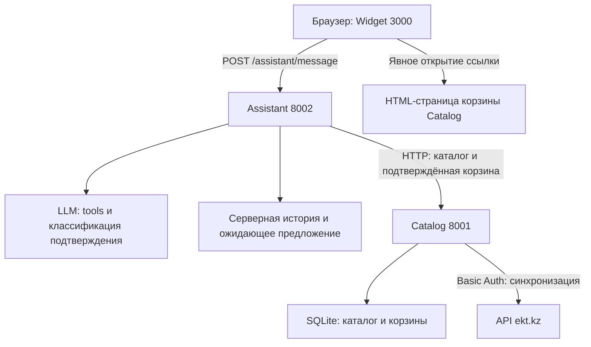

# HackAlem AI — консультант для ekt.kz

Готовый к локальному запуску прототип: Python 3.12 / FastAPI, SQLite, HTML/CSS/JavaScript без frontend-сборки. Три независимых HTTP-сервиса. Реальный tool calling через Chat Completions-совместимый API. Учебные данные явно обозначены. Это не официальная интеграция с корзиной ekt.kz.

## Реальные товары ekt.kz — START_EKT.cmd

Это обновление настроено по предоставленным пользователем JSON: список страницы 2 (20 items, per_page/count) и карточка 515291. Полный HTTP-доступ к ekt.kz из среды разработки недоступен; первое настоящее подключение выполняется на вашем Windows-компьютере.

1. Остановите старые серверы клавишами Ctrl+C.
2. Распакуйте обновлённый архив в новую папку и откройте `hackalem-ai`.
3. Дважды нажмите **START_EKT.cmd**.
4. На вопрос логина нажмите Enter (apiuser). Введите выданный партнёром пароль. Он не отображается — это нормально. Затем Enter.
5. Программа проверит реальный GET `/products/detail?id=515291`, затем включит локальную модель и запустит сервисы. Если Ollama ещё нет, завершите установку по открывшейся ссылке.
6. Сайт откроется сам. Дождитесь появления реальных карточек. В чате: «Расскажи о товаре 200300285_: цена, остаток, характеристики и противоречия».

Пароль хранится только в памяти процессов и их переменных окружения на время работы. В код, архив, браузер и JSON-каталог не записывается. Повторный запуск снова запросит пароль. Ошибки доступа показываются без секрета.

**Быстрый старт загружает первые 2 страницы, обычно до 40 товаров, а не весь магазин.** На витрине явно показаны размер выборки и время обновления. `count=20` не трактуется как число страниц. Для полного обхода перед запуском установите в PowerShell `$env:EKT_PAGE_LIMIT="0"` и выполните `py -X utf8 start_ekt.py`. Полный обход может занять долгое время. Предохранитель — 500 страниц; изменять max_pages следует только после согласования объёма. Обновление snapshot атомарно после успешной загрузки выбранного диапазона; одна ошибочная detail-карточка не обнуляет остатки и не затирает предыдущий snapshot.

Каждый товар списка дополнительно загружается из `/products/detail?id=…`: только там есть quantity и properties. Одновременно не более 4 detail-запросов; timeout 5 секунд и retry сохранены. `quantity` — итоговый остаток, склады не прибавляются к нему повторно. Состав offers пока не используется: варианты без валидного целого quantity не выдумываются. При неподдерживаемой схеме синхронизация сохраняет прошлый snapshot и пишет предупреждение.

Категория выводится из родительского пути URL товара, поскольку category в ответе отсутствует. Читаемые названия технических свойств взяты из mapping в adapter.py. Служебные CML2/RECOMMEND исключены. Фото/страница/описание/склады передаются внутри разрешённого specs; при подсчёте совпадений аналогов метаданные и складские остатки исключаются. Изображения разрешены только с https://ekt.kz и https://www.ekt.kz, HTML API выводится как текст.

**Противоречие в присланной карточке:** название/описание указывают 160 А, `NOMINALNYY_TOK` — 250 А. Оба значения сохраняются, выдаётся предупреждение. Сервер добавляет найденное предупреждение в ответ даже при пропуске моделью. Цена 64920 и quantity 23 относятся к присланному образцу: текущие значения берутся заново из API, а не вшиты в рабочий каталог.

В режиме live статические DEMO-карточки не выводятся. Витрина имеет отдельный read-only proxy `/catalog-data.json`, который обращается к существующим Catalog `/catalog/search` и `/health`; сам чат продолжает делать только POST `/assistant/message`. Пустой q в search разрешён для списка первой выборки, структура контрактов не менялась. Если API недоступен, сайт показывает ошибку или датированный последний кэш, а не подставляет синтетические цены.

Это подключение каталога, **не реальной корзины ekt.kz**. Корзина проекта и её ссылка сохраняются; партнёрский write/checkout API не предоставлен.

## Запуск без API-ключа: демонстрационный режим для Windows

Используйте `START_LOCAL_AI.cmd` — двойной щелчок в Проводнике Windows. Он вызывает `start_local_ai.py`.

1. Остановите старые три сервера: Ctrl+C в каждом терминале VS Code. Не запускайте два экземпляра проекта одновременно.
2. Распакуйте обновлённый архив в новую папку (сохраняйте старую папку, если нужны её корзины/настройки).
3. Откройте `hackalem-ai` и дважды нажмите `START_LOCAL_AI.cmd`.
4. Если Ollama не установлена, откроется https://ollama.com/download/windows . Скачайте и запустите официальный установщик. После установки вернитесь в окно запуска и нажмите Enter.
5. Скрипт скачает `qwen3:4b` (~2.5 ГБ), проверит загрузку модели, установит Python-зависимости в отдельное `.venv`, запустит три сервиса и откроет http://localhost:3000.
6. Оставьте окно открытым. Для остановки — Ctrl+C. Повторный запуск тем же файлом не скачивает модель и библиотеки заново, если они уже есть.

API-ключ не нужен: tool calling и классификация подтверждения выполняются настоящей локальной моделью через Ollama `/api/chat`, а не заменяются ответами по ключевым словам. Облачные ключи при этом не используются. Для первого скачивания нужен интернет. Ollama и модель занимают несколько гигабайт диска; 2.5 ГБ — только размер модели, не требуемая оперативная память. На компьютере с недостаточной памятью модель может не загрузиться. Быстрые ответы без сведений о CPU/GPU/RAM не гарантируются.

Скрипт оставляет данные и технические журналы в `.local-ai`, не убивает чужие процессы, проверяет порты и генерирует временный внутренний токен для своих сервисов. Все сервисы запускаются на loopback. Кэш и корзины локального запуска хранятся отдельно от старого запуска и Compose. Закрытие окна останавливает сервисы; Ctrl+C — предпочтительный способ корректного завершения.

Каталог остаётся явно демонстрационным; локальная модель не предоставляет доступ к настоящим остаткам ekt.kz. Подключение партнёрского API, вложения и официальный checkout имеют ограничения, описанные ниже. Покупка в прототипе ведёт в его собственную корзину, без оплаты.

### Что изменилось

- Windows UTF-8: явная кодировка при чтении system.md и demo.json.
- Ollama adapter: native tool arguments/ответы, JSON Schema классификатора, отсутствие API-ключа.
- Отдельное предложение и серверная проверка согласия сохраняются. Просроченное за время классификации предложение отклоняется.
- Для локальной модели увеличены пределы ожидания: 180 секунд на вызов, 300 секунд на ход, 315 секунд в браузере. Это режим для локального компьютера, а не гарантия производительности.
- При стандартном облачном запуске остаются прежние таймауты и необходимость ключа.

### Ручные настройки локальной модели

Launcher устанавливает их сам. Для собственного запуска: `LLM_PROVIDER=ollama`, `OLLAMA_URL=http://127.0.0.1:11434`, `LLM_MODEL=qwen3:4b`, `LLM_TIMEOUT=180`, `ASSISTANT_TURN_TIMEOUT=300`, `CHAT_TIMEOUT_MS=315000`. У widget должен быть `LLM_PROVIDER=ollama`, чтобы отображать локальный режим. Все эти значения — переменные окружения, не поле чата.

Локальный запуск не читает `.env` автоматически. Для настройки live-каталога передавайте env из оболочки; не записывайте пароли в `.cmd` и не присылайте их в чат. Облачный Docker-режим ниже сохраняется как отдельный вариант.

Официальные источники: https://docs.ollama.com/windows , https://docs.ollama.com/api/chat , https://ollama.com/library/qwen3:4b .

## Альтернативный облачный запуск через Docker: Windows / PowerShell

1. Установите Docker Desktop, включите Linux containers и запустите Docker Desktop.
2. Распакуйте архив. Откройте папку `hackalem-ai` в VS Code → **Terminal → New Terminal**.
3. Скопируйте настройки:

```powershell
Copy-Item .env.example .env
```

4. Откройте `.env`. Заполните `LLM_API_KEY` своим ключом. При необходимости задайте `LLM_BASE_URL` и `LLM_MODEL` у провайдера, поддерживающего tools и JSON Schema. Не вставляйте ключ в JS или в сообщения чата. Для локального демо оставьте `CATALOG_MODE=demo`.
5. Запустите:

```powershell
docker compose up --build
```

Если установлен отдельный Compose v1, эквивалент: `docker-compose up --build`.

6. Откройте http://localhost:3000. Остановить: Ctrl+C, затем `docker compose down`. Именованный том сохраняет каталог и корзины; `down -v` удаляет данные.

Без `.env` все три процесса тоже запускаются: каталог содержит синтетическую выборку, `/health` отвечает, сайт открывается. **В этом облачном Docker-режиме без ключа LLM свободный ИИ-диалог недоступен**: ассистент возвращает вежливую ошибку, а не притворяется моделью. Ключ и доступ к сети необходимы для полного сценария.

## Архитектура



- `catalog-service/catalog/api.py` — тонкие маршруты; `services.py` — правила; `data.py` — SQLite; `adapter.py` — все предположения о полях партнёра; `sync.py` — пагинация, detail, retry, атомарный snapshot.
- `assistant-service/assistant/service.py` — bounded tool loop и отдельная `may_execute`; `llm.py` — реальное обращение к модели; `storage.py` — заменяемый репозиторий сессий; `catalog_client.py` — HTTP-клиент.
- `chat-widget/public` — адаптивный интерфейс. Widget делает только POST `/assistant/message`; он не опрашивает health и каталог. Переход в корзину — обычная ссылка.
- `tests` — модульные и контрактные тесты; `run_tests.py` — единая точка запуска.
- `dist` — опубликованный статический просмотр интерфейса. Он не запускает Python-сервисы и честно сообщает об этом при отправке сообщения.

## Контракты

Названия JSON-полей сохранены в snake_case. Swagger: http://localhost:8001/docs и http://localhost:8002/docs.

| Сервис | Маршрут | Результат |
|---|---|---|
| Catalog | GET `/health` | status, catalog_items_cached, last_sync |
| Catalog | GET `/catalog/search?q=…&limit=…` | items |
| Catalog | GET `/catalog/product/{id}` | один item; 404 error |
| Catalog | GET `/catalog/analogs/{id}?limit=…` | items; исходный товар исключён |
| Catalog | POST `/cart/add` | success + cart либо success:false + error |
| Catalog | GET `/cart/{session_id}` | items, cart_url |
| Catalog | GET `/cart/view/{session_id}` | дополнительная HTML-страница актуальной корзины |
| Assistant | GET `/health` | status, catalog_service_reachable |
| Assistant | POST `/assistant/message` | reply_text, proposed_action, needs_confirmation, cart_url |

Все HTTP-ошибки используют `{ "error": { "code": "…", "message": "…" } }`. Ошибки валидации — 400, не стандартные FastAPI 422. Бизнес-отказ корзины — 200 с `success:false`. Количество — строго положительное целое; строки и bool вместо числа не принимаются. Session ID допускает 16–128 безопасных символов; браузер генерирует UUID v4.

## Подтверждение и идемпотентность

1. Модель вызывает только `propose_add_to_cart`. Сервер повторно читает товар, проверяет количество и показывает точный товар/qty/цену в собственном тексте предложения.
2. Предложение хранится **на сервере**, связано с session_id, действует 5 минут и только до следующего сообщения. Клиентский `history` не принимается за источник состояния и не попадает в модель: он предназначен для отображения в клиенте.
3. Следующий ответ отдельная модель классифицирует по строгой JSON Schema. Регулярных выражений «да» нет. Отказ, сомнение, условие, смена товара/qty и prompt injection не должны подтверждать.
4. Чистая функция `may_execute` проверяет точное совпадение product_id/qty, срок действия, confirmed и отсутствие injection_detected. Только после этого код вызывает POST `/cart/add`.
5. На каждый session_id действует lock; предложение потребляется до выполнения запроса. При таймауте автоматического повторного добавления нет: клиенту предлагают проверить корзину.

**Семантика `/cart/add`: установить qty позиции, а не прибавить qty.** Два одинаковых запроса оставляют одинаковое состояние. Изменение qty устанавливает новое количество. Это позволяет безопасно повторить запрос без изменения контракта и без Idempotency-Key. Проверка остатка и изменение выполняются под одним lock. Корзина не резервирует склад; цена и остаток повторно проверяются при реальном оформлении заказа (в MVP его нет).

Нельзя обещать математическую защиту «при любых формулировках» при семантическом подтверждении через LLM: возможны ошибки классификатора. Структурные ограничения жёсткие и тестируются; качество распознавания реальной моделью требует отдельного adversarial eval. Для production нужны подписанный confirmation challenge, отдельное явное действие UI и авторизованная корзина; это потребует расширения согласованного контракта.

## Данные партнёра

Для реального каталога задайте в корневом `.env`:

```dotenv
CATALOG_MODE=live
PARTNER_API_USER=
PARTNER_API_PASSWORD=
```

Заполните последние два поля выданными партнёром данными **только локально**. Перезапустите Compose. `demo.sqlite` и `live.sqlite` разделены: синтетические данные не подмешиваются при переключении на live.

Адаптер поддерживает предполагаемые варианты `id/ID`, `sku/article/ARTNUMBER`, `name/NAME`, `category/category_name/CATEGORY`, `price/PRICE`, `stock/quantity/QUANTITY`, specs/properties и certificate_url. Нулевая цена или остаток не подставляются при отсутствии обязательного поля — синхронизация отклоняется целиком. На каждую позицию читается `/products/detail?id=…`. Пагинация заканчивается total_pages/last_page либо пустой страницей; повторённая страница и превышение лимита считаются ошибкой.

**Адаптер обновлён по предоставленным пользователем list/detail JSON.** Самостоятельный HTTP-доступ к партнёру здесь не подтверждён. Не выдавайте предполагаемую схему за подтверждённую интеграцию. Синхронизация фоновая с пулом до 4 detail-запросов, timeout 5 секунд на запрос, 3 попытки с backoff 0.25/0.5 секунды. При ошибке сохраняется последний успешный snapshot и warning в JSON-логах. До первой успешной live-синхронизации каталог пуст. `last_sync=1970-01-01T00:00:00+00:00` обозначает отсутствие успешной синхронизации. Кэш может устареть, его возраст контролируется по health/logs.

Условия покупки и сертификаты в синтетической выборке отсутствуют: ассистент честно направляет к менеджеру. Он не выдумывает доставку, оплату и минимальную партию. Для полного must-have по содержательным условиям необходимо получить согласованные правила партнёра и добавить доверенный источник условий (или расширить контракт). Проверка сертификата поддерживается при наличии certificate_url в реальном каталоге. Синтетические сертификаты не создавались.

## Тесты одной командой

При установленном Python 3.12+:

```powershell
py -m pip install -r requirements.txt
py run_tests.py
```

На Linux/macOS используйте `python` вместо `py`. Только запуск после установки зависимостей — одна команда `python run_tests.py`.

Через Docker без локального Python:

```powershell
docker compose run --rm -v "${PWD}/tests:/app/tests" -v "${PWD}/assistant-service/assistant:/app/assistant" -v "${PWD}/assistant-service/prompts:/app/prompts" -v "${PWD}/catalog-service:/app/catalog-service" assistant-service python -m pytest -q /app/tests
```

Для максимально переносимого контейнерного прогона также есть `Dockerfile.test`: `docker build -f Dockerfile.test -t hackalem-tests .` затем `docker run --rm hackalem-tests`.

В тестах нет внешних вызовов и секретов. FakeLLM подменяет только границу модели; тесты проверяют orchestration, передачу настоящих fixture-данных из каталога и запрет побочных эффектов, но не доказывают качество ответов реального провайдера. См. `VERIFICATION.md` для реально выполненных проверок.

## Сценарий защиты: 3 сообщения

Откройте новый чат с подключённой LLM и `CATALOG_MODE=demo`:

1. **«Есть ли DEMO-C16? Назови цену, остаток, характеристики и есть ли сертификат. Какие условия оплаты и доставки?»** Ожидается 1890 ₸, 24 шт., 16 А / 1P / C / 4.5 кА; честное отсутствие сертификата и подтверждённых условий.
2. **«Нужен DEMO-C16-OLD, 2 штуки. Если его нет, найди аналог, объясни сходство и предложи добавить его в корзину.»** Ожидается нулевой остаток исходного товара, DEMO-C16 с совпадающими характеристиками и отдельное предложение на 2 шт. На этом этапе корзина пуста.
3. **«Ок, беру предложенный DEMO-C16, добавляй 2 штуки.»** Ожидается успешное добавление и кнопка «Перейти в корзину». Нажмите её: HTML-страница показывает 2 шт., итог 3780 ₸.

Дополнительная проверка отказоустойчивости: `docker compose stop catalog-service`, затем спросите о товаре. Ассистент возвращает вежливую ошибку; `/health` остаётся 200, `catalog_service_reachable=false`. Возврат: `docker compose start catalog-service`.

## Ограничения и переход в production

- Compose привязывает порты только к localhost. Публикация на сервер требует TLS, reverse proxy, корректных публичных URL и CORS. Выставлять demo с пустым INTERNAL_API_TOKEN в интернет нельзя. Установите длинный случайный общий токен: Assistant передаёт его в Authorization, Catalog проверяет на /cart/add. Браузер его не получает.
- UUID сессии является bearer-capability, а не авторизацией пользователя. Для production: пользовательская auth, принадлежность корзины, rate limits, CSRF при cookie-auth, аудит, ограничение размера HTTP-body на proxy, шифрование и политика хранения.
- Один worker у Assistant, MemorySessions с TTL 1 час и лимитом 5000 сессий. После рестарта визуальная история сохраняется в localStorage, но предложение надо сформировать заново. Для нескольких реплик — Redis/БД и распределённая блокировка. SQLite хранит каталог и корзины на диске.
- Чат ограничен текстом согласованного контракта. Фото/Excel/Word/PDF из расширенного кейса **не реализованы**: текущий POST не имеет поля вложений. Для них нужны upload-контракт, ограничения формата/размера, антивирус, OCR и безопасный парсинг.
- В режиме demo карточки статические и подписаны. START_EKT.cmd включает live-витрину и убирает DEMO-карточки; поиск чата идёт через Assistant → Catalog.
- Корзина прототипа не передаётся в ekt.kz: партнёр предоставил read-only catalog API, контракт записи в его checkout отсутствует. Платёжных форм нет.
- Tool loop максимум 6 шагов, Catalog timeout 3 секунды, LLM timeout 12 секунд, полный ход 25 секунд. Обычно ответ быстрее, но «единицы секунд» зависят от модели/сети и не гарантированы. На большом каталоге замените последовательную detail-синхронизацию ограниченным пулом запросов и согласуйте rate limits.
- Не отправляйте платёжные данные: есть консервативный фильтр карточных номеров, IBAN и CVV/PIN перед сохранением и передачей; нестандартные способы записи всё равно требуют полноценного DLP. Для production нужен фильтр чувствительных данных до логирования и передачи, DPA с провайдером, удаление по запросу и сроки retention. Логи запросов здесь не содержат текста чата или секретов.

## Документация протокола LLM

Официальный tool-calling flow: https://developers.openai.com/api/docs/guides/function-calling . Код использует HTTP-клиент, поэтому SDK провайдера не требуется.
